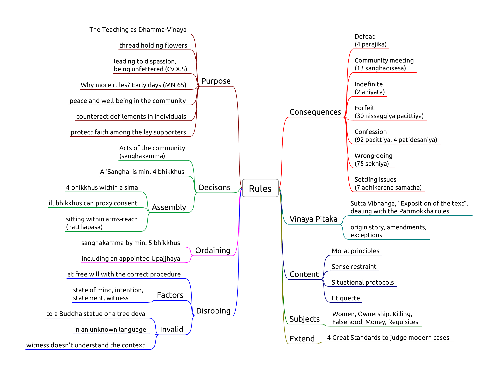

# Introduction

-   Pāṭimokkha: 227 rules, 4 entails automatic expulsion (defeat)
-   They contain moral principles, sense restraint, situational
    protocols, etiquette
-   No physical punishment but procedures, forfeit, confession
-   The Buddha established the rules one at a time
-   Dhamma-Vinaya, Teaching and Discipline
-   Each rule includes its origin story, amendments and exceptions
-   5 factors: object, effort, intention, perception, result
-   Blanket exemptions: insane, possessed by spirits, delirious with
    pain, the first offender
-   Common non-offences: unknowingly, unthinkingly, unintentionally
-   4 Great Standards to judge modern cases
-   Min. 4 bhikkhus for Sangha actions and decisons
-   Ordination requires min. 5 bhikkhus
-   Disrobe at free will but follow the correct procedure
-   'Kor wat' house-rules per monastery
-   International agreements (Mahathera Samakorn, ECM)

<!-- latex
\begin{multicols}{2}
-->

The ten reasons for the establishing of the Pāṭimokkha:

1.  "For the excellence of the Sangha;
2.  for the wellbeing of the Sangha;
3.  for the control of ill-controlled bhikkhus;
4.  for the comfort of wellbehaved bhikkhus;
5.  for the restraint of the *āsavā* in this present state;
6.  for protection against the *āsavā* in a future state;
7.  to give confidence to those of little faith;
8.  to increase the confidence of the faithful;
9.  to establish the True Dhamma;
10. to support the Vinaya."

(Vin.III.20; A.V.70)

<!-- latex
\columnbreak
-->

Four things not to be done, *akaraṇīya*:

1.  sexual intercourse: as a man with his head cut off cannot live
2.  theft: as a withered leaf separated from its stalk cannot become
    green again
3.  depriving a human being of life: as a flat stone, broken in half,
    cannot be put together again
4.  claiming false attainments: as a palm tree, cut off at the crown, is
    incapable of further growth

([Vin.I.96-97](https://suttacentral.net/pli-tv-kd1/en/horner-brahmali))

<!-- latex
\end{multicols}

\clearpage
-->

## The Four Great Standards

<!-- latex
\begin{multicols}{2}
-->

Not already prohibited:\
**if** it conforms with what is prohibited,\
**or** it goes against what is allowable,\
that is **prohibited**.

Not already prohibited:\
**if** it conforms with what is allowable,\
**or** it goes against what is prohibited,\
that is **allowable**.

<!-- latex
\columnbreak
-->

Not already allowed:\
**if** it conforms with what is prohibited,\
**or** it goes against what is allowable,\
that is **prohibited**.

Not already allowed:\
**if** it conforms with what is allowable,\
**or** it goes against what is prohibited,\
that is **allowable**.

<!-- latex
\end{multicols}
-->

(Mv.VI.40.1)

