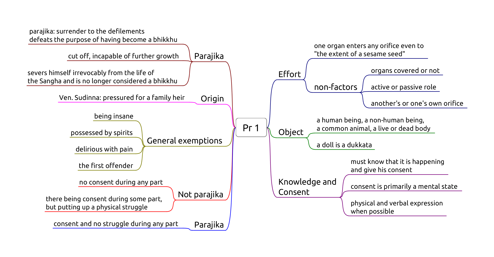
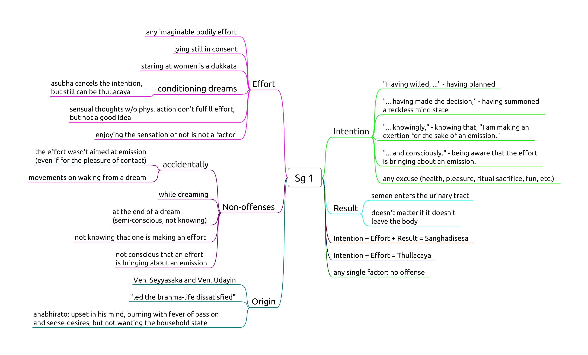

# Sexual Conduct

- **Pr 1,** Sexual intercourse
- **Sg 1,** Intentional emission of semen

## Pr 1, Sexual intercourse

-   as a man with his head cut off cannot become one to live again
-   as a withered leaf separated from its stem cannot be joined again
-   as a flat stone that has been broken in half cannot be put together
    again
-   as a palmyra tree cut off at the crown is incapable of further
    growth.

## Sg 1, Intentional emission of semen

A bhikkhu who comitted a sanghadisesa must inform another bhikkhu as
soon as possible, but at most until the next dawnrise. The Sangha must
meet and at his request, allow a six-day period of penance (*mānatta*).
If he concealed the offence, a probation period (*parivāsa*) is required
beforehand.

He may choose where to observe the penance, but he can only be
rehabilitated as a bhikkhu in regular standing by a community meeting of
at least 20 bhikkhus.
