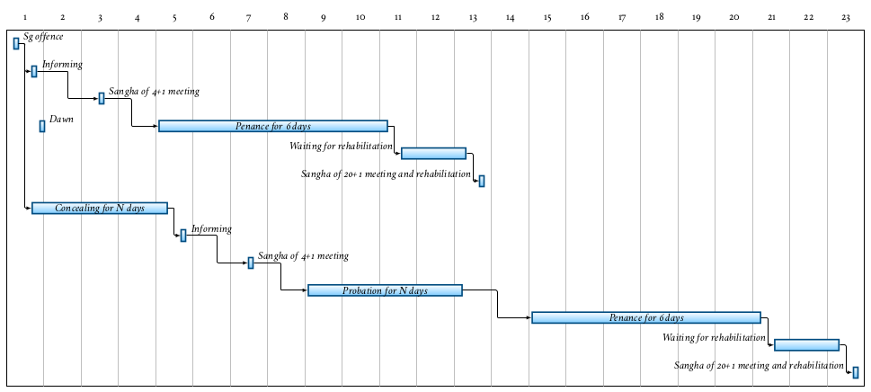

# Sexual Conduct

- **Pr 1,** Sexual intercourse
- **Sg 1,** Intentional emission of semen

## Pr 1, Sexual intercourse

- "... For *that* action you would only suffer death, for *this* action you will suffer in hell.
- As a man with his head cut off cannot become one to live again.
- As a withered leaf separated from its stem cannot be joined again.
- As a flat stone that has been broken in half cannot be put together again.
- As a palmyra tree cut off at the crown is incapable of further growth."

<!-- latex
\clearpage
-->

## Sg 1, Intentional emission of semen

- "with the same hand you use to eat the gifts of the faithful"
- trust and good will of the supporters, social contract

Result is fulfiled when the semen enters the urinary tract, since at that point
the process is irreversible, even when semen was not emitted, being blocked in
some way.

### Probation and Penance

<!-- noexport_latex_begin -->

<!-- noexport_latex_end -->

<!-- latex
\enlargethispage*{4\baselineskip}
\par
\includemap[0.9\paperwidth]{../../src/includes/figures/sanghadisesa-procedure.png}
\par
\clearpage
-->

*(Figure: Overview of the procedure after a Sanghadisesa offence, comparing the
case of immediately informing and concealing.)*

One doesn't have to wait until one is certain about the offence, speaking to
another bhikkhu about a doubtful situation will at least clear one's conscience
that one is not concealing it.

A bhikkhu who comitted a sanghadisesa must inform another bhikkhu as
soon as possible, but at most until the next dawnrise. The Sangha must
meet and at his request, allow a six-dawn period of penance (*mānatta*).
If he concealed the offence, a probation period (*parivāsa*) is required
beforehand.

The Sangha will determine when and where the bhikkhu should observe the
*parivāsa* and *mānatta*. These periods are determined by the Sangha and don't
have to occur back-to-back.

After completing *mānatta* he can only be rehabilitated as a bhikkhu in regular
standing by a community meeting of at least 20 bhikkhus. He is not required to
stay at that particular monastery after having received rehabilitation.

If he commits another sanghadisesa before rehabilitation, he must inform a
bhikkhu and ask a Sangha of at least four to 'send him back to the beginning.'

There is allowance to interrupt and set aside the penance or probation for a
period of time, for example when many visiting monks are expected to arrive at
the monastery for an event.

Characteristic duties during penance:

- not receiving duties of respect from other bhikkhus
- inform visiting bhikkhus that he is undergoing penance
- every day, notify every bhikkhu in the monastery of his offence
- stay under a separate roof than the other bhikkhus
- only leave the monastery when accompanied by four other bhikkhus

The duties during probation are the same as during penance, except:

- inform the Sangha of his offence every fortnight, not every day
- only leave the monastery when accompanied by a single other bhikkhu

### Sensual thoughts

Sensual thoughts are not designated a penalty, but they grow quickly and lead to
one's downfall.

> The thought occurred to the deva living in the sala tree ... "It's pleasant,
> the touch of this maluva creeper's soft, tender, downy tendril." (MN 45)

When reconizing that one has been caught up in a sensual fantasy, immediately
visualizing *asubha* of the body can break up the lustful mental state.

Repeatedly training to notice the signs of *asubha* changes the unconscious
habits of the dreaming mind as well.

> Monks, if a sensual thought, a thought of ill-will, or a thought of harming
> arises in a monk while walking, standing, sitting or lying down, and he
> tolerates it, does not abandon it, dispel it, terminate it, and obliterate it,
> then that monk is said to be devoid of ardour and wise fear of consequences;
> he is constantly and continuously lazy and lacking in energy while walking,
> standing, sitting or lying down. (AN 4.11)

