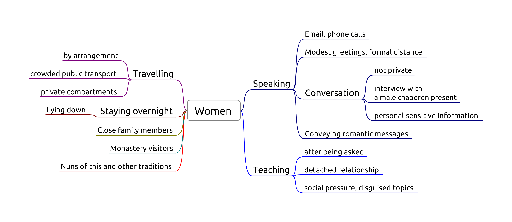

# Women 1

-   **Sg 5,** Conveying romantic messages
-   **Pc 6,** Lying down with a woman
-   **Pc 44,** Private secluded place
-   **Pc 45,** Unsecluded but private place
-   **Pc 67,** Travelling by arrangement with a woman

> 'Lord, what course should we follow with regard to womenfolk?'
> 
> 'Not-seeing, Ānanda.'
> 
> 'But when there is seeing, lord, what course should be followed?'
> 
> 'Not-addressing, Ānanda.'
> 
> 'But when we are addressed, what course should be followed?'
> 
> 'Mindfulness should be established, Ānanda.'
> 
> *[DN 16](https://www.dhammatalks.org/suttas/DN/DN16.html)*

## Sg 5, Conveying romantic messages

Origin: Ven. Udāyin acts as a matchmaker between several families, some of whom didn't even know each other before. For some matches they praise him, for other matches they curse him. In one particular case they treat the girl like a slave, who repeatedly sends unhappy messages back to her family. ([Vib. Ss. 5](https://suttacentral.net/pli-tv-bu-vb-ss5/en/brahmali))

Only two factors: effort and object.

**Effort:** 'Conveying' messages for any romantic purpose from a momentary date to a wedding. Not business meetings.

<!-- latex
\clearpage
-->

Three stages:

-   *accepting* the request to convey a message
-   *inquiring* at the second party
-   *reporting* the response

Dukkaṭa for any single stage, thullacaya for any two, saṅghādisesa for all three.

Carrying a letter without knowing the content doesn't fulfill effort.

Keeping email and phone contacts private. Nonetheless it fulfills *inquiring*.

**Object:** A man and a women who are not married to each other, even if dealing with them via other people.

Reconciling a still married couple is not an offense. Reconciling a divorced couple is saṅghādisesa.

<!-- latex
\enlargethispage{2\baselineskip}
-->

**Non-offenses:** messages about non-romantic errands, e.g. community business, a shrine, a sick person.

'Being married' is clear in the case of a church- or civil marriage, or if there had been some other formal civic arrangement. Other, more vague, customary forms of living together, sharing a child, or long-term relationships become difficult the determine.

## Pc 6, Lying down with a woman

Origin: Ven. Anuruddha stays at the house of a wealthy woman for a night. She approaches him, but he remains unmoved, and she leaves. There was no offense, but the rule is established to avoid similar situations.

**Object:** Female human being, even a baby, one's relative or not.

**Effort:** in the instant one lies down in the same dwelling when a woman is lying down.

Same dwelling: one 'enclosure'. Technically the same walls and roof, but one may consider variations (private hospital rooms).

Intention is not a factor, pacittiya even if the bhikkhu doesn't know about the woman.

Purpose: to avoid situations where people might think that one may have commited serious offenses. Other people might see the situation and rumors would be damaging.

Non-offenses for roofed but no walls (pavilion) or walled but not roofed (corral), but a good idea to avoid nonetheless.

## Pc 44, Private secluded place

Origin: Ven. Upananda sat down with the wife of a friend on a private and concealed seat. Later, the husband complained and criticized him. The Buddha rebuked Ven. Upananda, 'Foolish man, how can you sit in private on a concealed seat with a woman? This will not give rise to confidence in those without it...' ([Vibh. Pc. 44](https://suttacentral.net/pli-tv-bu-vb-pc44/en/brahmali))

The bhikkhu sits with a woman at a secluded place, private to the eye and ear, without another man present, aiming at privacy. Secluded enough for pārājika.

**Effort:** sitting or lying down at the same place, even if not the same seat.

### Non-offenses

<!-- latex
\vspace*{-0.5\baselineskip}
\enlargethispage{\baselineskip}
-->

- if a knowledgeable man is present
- if the woman entered the room later, and he didn't notice
- either or both of them are standing

## Pc 45, Unsecluded but private place

The bhikkhu sits with a woman at a private, but not secluded place, such as an empty park, without another *person* present. Secluded enough for saṅghādisesa.

## Pc 67, Travelling by arrangement with a woman

Origin: a woman hears that a monk is going to a village and goes with him. Later, the woman's husband heard about it and gave him a beating.

Purpose: to avoid people assuming the bhikkhu having an affair with the woman.

In the monastery, female lay supporters often help with transport which are arranged. This becomes casuse for concern when a bhikkhu arranges to travel with the same woman again and again.

**Object:** Any woman who knows what is lewd.

**Perception** is not a factor.

**Effort:**

1.  having made an arrangement to travel together
2.  they travel as arranged
    -   time frame as arranged
    -   route or place of departure doesn't count
3.  from one village to another (half-yojana, 8km)

**Making an arrangement:** both gives verbal or written assent to the arrangement.

Giving assent in silence is not an offense.

-   if the women doesn't respond: *dukkaṭa*
-   if the bhikkhu doesn't respond: no offense

### Non-offenses

-   coincidence: they happen to travel together
-   the woman proposes the arrangement, and the bhikkhu doesn't give *verbal* assent
-   leaving at a significantly different time than as arranged
-   there are dangers

### Cases

- public transport
- private transport (Pc 44)

<!-- latex
\clearpage
-->

> 'But what, Master Gotama, is a gap, a break, a spot, a blemish of the holy life?'
>
> - 'He does consent to being anointed, rubbed down, bathed, or massaged by a woman
> - he jokes, plays, and amuses himself with a woman
> - he stares into a woman's eyes
> - he listens to the voices of women outside a wall as they laugh, speak, sing, or cry
> - he recollects how he used to laugh, converse, and play with a woman
> - he sees a householder or householder's son enjoying himself endowed with the five strings of sensuality
> - he practices the holy life intent on being born in one or another of the deva hosts
>
> 'He enjoys that, wants more of that, and luxuriates in that. This is a gap, a
> break, a spot, a blemish of the holy life. He is called one who lives the holy
> life in an impure way, one who is fettered by the fetter of sexuality. He is
> not freed from birth, aging, & death, from sorrows, lamentations, pains,
> griefs, & despairs. He is not freed, I tell you, from suffering & stress.'
>
> ([AN 7.47](https://www.dhammatalks.org/suttas/AN/AN7_47.html))
