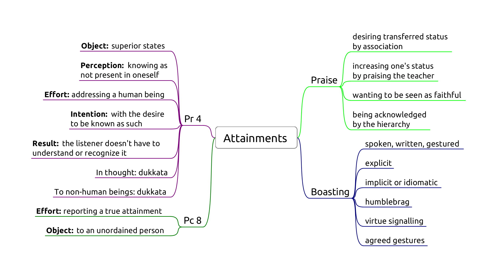

# Attainments

-   **Pr 4,** Lying about superior attainments
-   **Pc 8,** Telling unordained person about actual attainment

## Pr 4, Lying about superior attainments

Extreme case of lying (Pc 1).

Origin: During a period of drought and famine, certain bhikkhus praised each other's false attainments to the lay people so that they may have a comfortable Vassa. ([Vibh. Pr 4](https://suttacentral.net/pli-tv-bu-vb-pj4/en/brahmali))

> How can you for the sake of your stomachs praise one another’s superhuman
> qualities to lay people? It would be better for your bellies to be cut open
> with a sharp butcher’s knife than for you to praise one another’s superhuman
> qualities to lay people.
>
> Why is that? Because for that reason you might die or experience death-like
> suffering, but you wouldn’t because of that be reborn in a bad destination.
> But for *this* reason you might.

<!-- latex
\clearpage
-->

Five great gangsters as bad monks:

1. wanting to be honoured, revered and obtain gifts
2. learning the Buddha's teachings and taking it as his own
3. accusing a pure practitioner of the holy life of sexual intercourse
4. taking and using Sangha property to create a following among lay people
5. 'But in this world this is the greatest gangster: he who untruthfully and groundlessly boasts about a superhuman quality. Why is that? Monks, you’ve eaten the country’s almsfood by theft.'

**Object:** superior human states which are not accessible to mundane, ordinary people (*puthujjana*). States are categorized in three groups.

*Mahaggata dhamma*, 'expanded states'. Some are are supra-mundane if they depend on higher jhanas.

*Lokuttara dhamma*, 'transcendent states'. Always supra-mundane. Related to the eradication of the mental fetters. Nine: Nibbāna plus the four paths and their four fruitions.

*Tiracchāna-vijjā*, 'animal knowledge'. Always mundane. Examples are occult abilities, future-telling, giving protective charms, casting malevolent spells, psychic healing, practicing as a medium, etc.

**Perception:** knowing as non-existent, not present in oneself. If it is a mistaken claim out of overestimation, that would not be parajika.

*Non-existent* defined as 'not to be found; not knowing, not seeing a skillful state within oneself, (yet saying,) "There is a skillful state within me."'

**Effort:** Addressing a human being. Speaking about the state withing oneself, or one being in the state.

Explicit:

- 'I have attained the first jhāna'
- 'I have seen the heavenly realms'
- 'I know my previous lifetimes'

Implicit or idiomatic:

- 'I delight in an empty dwelling' (referring to jhāna)
- 'I have no doubts about the Buddha's teaching' (referring to stream entry)

Humblebrag:

- 'I am so dumb that before this retreat I didn't understand jhānas.'
- 'I am a really slow learner, but I don't have any doubt that the Buddha is right.'
- 'My meditation is nothing much, but you know, sometime you can see really interesting things...'

Virtue signalling:

- 'I have learnt to bow like this from a real Forest Kruba Ajahn.'
- 'Those monks talk about football. How could they have even basic samādhi?'

Gestures by agreement:

- 'The first who leaves their kuti is an arahant.'

False claims made *in thought* are assigned a *dukkaṭa* by the Buddha. (Story: seen by a bhikkhu who could read minds and a devata.)

**Intention:** to misrepresent the truth, motivated by an evil desire.

- knowing that it is a lie, aiming to misrepresent the truth
- motivated by an evil desire

Evil desire: that others may think of him as such.

**Result:** the understanding of the speaker and the listener.

The bhikkhu must understand that he is making a claim. The listener doesn't have to understand or recognize it.

### Suggested states

Lay supporters may address a teacher with exaggerated faith: 'May the venerable arahant explain to me...'.

Suporters may suggest states: 'We would like to invite four sotāpanna monks to start a temple in our town.'

There is no offense in coming, sitting, etc., as long as the intention is just to accept the invitation and not to imply a claim.

### To impress

Special practices (dhutaṅga, long periods of meditation, vegetarianism) out of the desire to impress others: dukkaṭa. Blameless reasons out of desire to practice are not an offense.

### Non-offenses

- mistaken and exaggerated understanding of one's mental states
- not intending to boast, others trying to read a statement as an implied claim

## Pc 8, Telling unordained person about actual attainment

Origin: similar to Pr 4, but with bhikkhus who boasted of true attainments of each other to get more food during a famine.

**Effort:** reporting a true attainment.

**Object:** to an unordained person.

**Intention** is not a factor, including motivations to inspire.

Good conduct between bhikkhus: Ven. Mogallāna waits to relate his vision until in the presence of the Buddha.

### Non-offenses

- to a bhikkhu or bhikkhuni
- display of psychic power is not assigned an offense, but strongly critized by the Buddha (monk and the wooden bowl)

