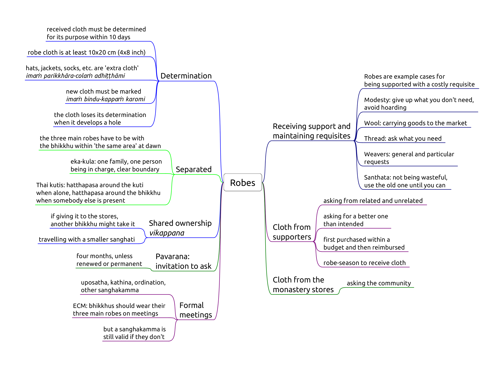

# Robes 1

-   **NP 1,** Keeping robe cloth for more than 10 days
-   **NP 2,** Separated from robe
-   **NP 3,** Out of season robe cloth
-   **NP 6,** Asking for robe cloth
-   **NP 7,** Excess robe cloth
-   **NP 8,** Request to improve robe
-   **NP 9,** Request to combine robe funds
-   **NP 24,** Seeking for a rains-bathing cloth
-   **NP 28,** Keeping robe cloth offered in urgency
-   **NP 29,** Separated from in a dangerous place
-   **Pc 58,** Unmarked robe
-   **Pc 89-92,** Proper robe sizes

<!-- latex
\vspace*{-2\baselineskip}
-->

## NP 1, Keeping robe cloth for more than 10 days

<!-- latex
\enlargethispage{2\baselineskip}
-->

Origin: the Buddha sees monks carrying heaps of robes tied on their heads, backs and hips. He sits outside in February when snow was falling to determine how many robes are reasonable (set of three). The group of six starts to keep several sets in different monasteries, so the Buddha sets a limit on keeping the excess, and allows further cloth to be placed under shared ownership.

Encouraging modesty to avoid hoarding requisites.

**Object:** a piece of cloth which *could* be used for making part of a robe, at least 10 x 20 cm (4 x 8 in). It has to be a suitable material for *bhikkhus*. Leather is unsuitable. Black, blue, crimson are not suitable colours for a robe.

**Effort:** keeping it for more than ten days without determining it for use.

*Making a robe:* they can use cloth from the stores to make a robe for the community, and later request it during a formal meeting such as *uposatha*.

Or, they may determine the plain cloth before the sewing project and re-determine the finished item later.

There is no time limit on cloth placed under **shared ownership**.

**Perception** is not a factor, mis-counting the days is not an excuse.

If the robe develops a hole, it loses its determination. It has to be mended within 10 days, and determined for use again.

Holes which are small, or located within a hand-span along the edge don't cause the determination to lapse, but when mended, may require the robe to be re-determined.

**Robe-season:** 4th lunar month of *Vassāna*, from the full moon in October. During that time one may receive and keep robe-cloth for more than ten days. May be extended with an additional 4 lunar months until the last Full Moon of Hemanta (mid-March) after a Kathina ceremony.

## NP 2, Separated from robe

Origin: bhikkhus go travelling on a tour. They leave their saṅghāṭis behind at the monastery, where the bhikkhus are burdened with having to keep sunning them to stop them from getting mouldy.

**Object:** either one of the bhikkhu's *currently determined* three main robes, the *antaravāsaka* (sabong, lower robe), *uttarāsaṅga* (jiwon, upper robe), and *saṅghāṭi* (outer robe).

This rule doesn't apply to other cloth requisites, such as a work-sabong or an old jiwon used as a bedsheet.

**Effort:** at dawnrise, being outside of 'the same area' than where one's robes are located.

*Days and Dawns:*

The Vinaya definition for *one day* is the period of time between two dawnrises.

If one extends a hand and is able to see the lines in the palm (assuming the sky is clear), the dawnrise *has already passed*.

One may also use a clock and the time of *nautical twilight*. While the Sun is between 12 and 6 degrees below the horizon, dawnrise *has not yet passed*. Once the Sun is less than 6 degrees below the horizon, dawnrise *has passed*.

'*The same area*' may be within *hatthapāsa* (arm's reach), in the same room, building, or the monastery grounds, depending on the local *kor-wat*.

*Eka-kula*: 'one family', or one roof, where one person is in charge, with a clear boundary.

*Thai kutis*: when the bhikkhu is alone, the area is his kuti and hatthapasa around it. When somebody else is present, hattapasa from his body.

Exception during the robe-season, if one is eligible for extending the *kathina* privileges, and unless one has relinquished those privileges. (The 1st month always applies, one may relinquish the additional 3 months.)

**Formal meetings:**

By ECM custom, bhikkhus should be present with their three main robes on formal meetings (e.g. uposatha, kathina, ordination).

Nonetheless, *saṅghakamma* would be still valid without bhikkhus having their three robes.

## NP 3, Out of season robe cloth

One may receive robes at any time, but keep it undetermined for only 10 days outside the robe-season.

This rule allows extra robe-cloth to be kept for up to 30 days, when it is not enough for a robe, and one is expecting to receive more cloth later.

## NP 6, Asking for robe cloth

Asking a lay supporter who is not a relative, for robe-cloth, except when one's robes have been stolen or destroyed.

A bhikkhu who arrives at a monastery with no cloth to cover himself may take any cloth he finds to wear, if he intends to return it when he obtains a proper robe.

## NP 7, Excess robe cloth

When one's robes have been stolen or destroyed, one may ask for cloth at most the amount enough for an upper- and lower robe.

There is no offense for accepting cloth when the donors are offering it for a different reason.

## NP 8, Request to improve robe

An unrelated householder wishes to purchase robes for the bhikkhu, and he suggests purchasing a more expensive one.

No offense when the lay person is a relative, or has invited one to ask for cloth.

## NP 9, Request to combine robe funds

As NP 8, but in this case two householders are offering to sponsor individual pieces of robe, and the bhikkhu suggests them to purchase a more expensive robe by combining their funds.

## NP 24, Seeking for a rains-bathing cloth

<!-- latex
\enlargethispage{\baselineskip}
-->

Origin: A servant girl goes to the monastery and sees the bhikkhus bathing in the rain. She returns to Lady Visākha, and tells her that there were no bhikkhus there, only naked ascetics. She asks the Buddha for permission to provide rains-bathing cloth for the bhikkhus.

The proper time to seek a rains-bathing cloth is the last month of the hot season. It may be worn in the last half-month of the hot season and during the rains season.

One may ask relatives, or supporters who have provided such cloth in the past.

## NP 28, Keeping robe cloth offered in urgency

The robe-season begins with the full moon of Kattika in October, but if a supporter has urgent reason and can't wait until that time, the bhikkhus may accept robe-cloth from him 10 days prior, and keep it until the end of the robe-season.

## NP 29, Separated from in a dangerous place

During the month after the Kattika full moon, a bhikkhu who lives in a dangerous wilderness, may keep either one of his robes in the village, for up to six days. The Sangha may authorize a longer period.

## Pc 58, Unmarked robe

When a bhikkhu receives a new robe, he should mark it for easy identification, before determining it for use.

A green, blue, brown or black mark is suitable.

It is suitable to make three small dots in one corner of the robe, saying, '*Imaṁ bindu-kappaṁ karomi*,' (I make this properly marked) while making each dot.

There is no need to make a new mark if it wears off, or if the robe has already been used (and marked) before.

It is suitable to mark any cloth item (angsa, bags, hats) which one wears on the body.

## Pc 89-92, Proper robe sizes

One *sugata span*: uncertain value, but taken as 25 cm in the BMC.

*Pc 89*, sitting cloth: 2 x 1.5 span + 1 span border

*Pc 90*, skin-eruption cloth: 4 x 2 span

*Pc 91*, rains-bathing cloth: 6 x 2.5 span

*Pc 92*, robe: 9 x 6 span

