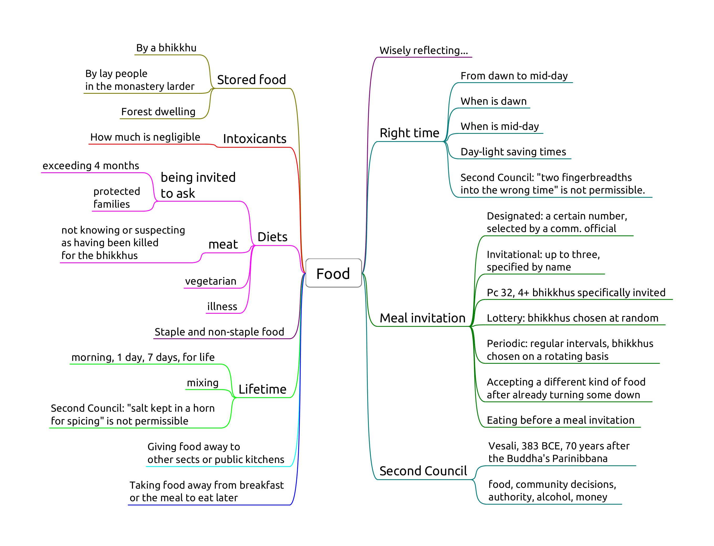

# Food 1

-   **Pc 31,** Public alms centre
-   **Pc 37,** Eating at the wrong time
-   **Pc 38,** Stored food
-   **Pc 40,** Unoffered food
-   **Pc 51,** Intoxicants
-   **Pd 4,** In a forest dwelling

<!-- latex
\clearpage
-->

## Pc 31, Public alms centre

One may eat one meal at a public alms centre, not two or more days in a row.

Origin: the group of six feel tired of almsround and keep going to the same
public kitchen.

Soup kitchens, homeless shelters, etc. Any place where all comers are offered
food free of charge.

### Non-offences

- one is invited by the owners
- being ill (not being able to leave)
- the food is intended for bhikkhus
- the centre limits the amount of food one may take (thus being able to censure
  a greedy person)

## Pc 37, Eating at the wrong time

Eating staple or non-staple food, from mid-day until dawnrise.

Mid-day, or nood, is when the Sun is at zenith. This may be a few minutes ahead
or behind of 12:00. It may be around 13:00 during daylight-savings time.

'Eating' is defined as 'entering the mouth'.

Swallowing food disloged from between the teeth, or chewing and swallowing
unchewed food passed up from the stomach is not an offence.

Being ill is not an exception, since the 7 day tonics are allowed for that
reason.

## Pc 38, Stored food

Origin: The Ven. Belatthasisa keeps the leftover rice from his alms-round and
moistens it the following day, to stay in solitude. Even though the motivation
(frugality) is innocent, the Buddha still rebukes him and recommends going
alms-round every day instead.

The convenince of stored food can lead to lack of effort to train and being
disconnected from reality.

> "In the course of the future there will be bhikkhus who will live entangled
> with monastery attendants and novices. As they are entangled with monastery
> attendants and novices, they can be expected to live intent on many kinds of
> stored-up consumables and on making blatant signs (identifying their) land and
> crops." (AN 5.80)

'Stored-up' means formally received by any bhikkhu, and keeping it beyond the
next dawn.

Relinquishing it to a novice or lay people, who may store and offer it later is
allowed. If the bhikkhu hasn't relinquished it, it is not allowable (dukkata).

**Perception** about the food having been stored-up is not a factor.

### Non-offences

<!-- latex
\vspace*{-0.5\baselineskip}
\enlargethispage*{2\baselineskip}
-->

- the act of storing it is not an offence, a bhikkhu may carry a lay person's
  food while travelling
- no offence for telling an unordained person to store it
- a designated food-store is allowed
- no offence for setting food aside and consuming it withing the right period

<!-- latex
\clearpage
-->

## Pc 40, Unoffered food

Origin: a bhikkhu eat food which was left as dedication to the ancestors in a
cemetery. People complained and criticized. "That bhikkhu is strong, perhaps he
feeds on human flesh."

**Object:** whatever is fit to eat.

One may drink water, or use tooth-cleaning sticks without it being offered.

**The act of offering** is described in the Vibhanga.

- Standing within hand's reach (*hatthapasa*),
- receiving with the hand,
- with something in contact with the body,
- or the item being dropped and caught.

**Effort:**

- dukkata for taking the unoffered item
- pacittiya for every mouthful

**Perception** of the item being offered or not is not a factor.

The allowance to pick up fallen fruit in times of scarcity and famine was later
rescinded.

### Non-offenses

- make and take an antidote in the case of emergency
- a non-human being may offer the food

## Pc 51, Intoxicants

Origin: Ven. Sāgata awes the lay supporters in Kosambi with his psychic power by
doing battle with a fire-nāga. The supporters ask the bhikkhus what they could
offer or prepare for them. The group of six ask them to prepare liquor. When the
supporters see Ven. Sāgata on alms-round, they offer him liquor house after
house, and he passes out at the city gate. The Buddha and other bhikkhus see
him, and carry him back to the monastery. There, he forgets being deferential to
the Buddha and sleeps in a helpless stupor.

**Object:** any alcoholic beverage.

Alcohol is criticized because it destroys one's sense of shame, weakens one's
discernment and can put one into a stupor. Hence this rule is extended to other
intoxicants such as narcotics and hallucinogens by the Great Standards.

**Perception** about whether a liquid counts as alcoholic is not a mitigating
factor. For example drinking champagne when thinking it to be carbonated apple
juice.

**Effort:** taking any amount, even as little as the tip of a blade of grass.

### Non-offences

- eating food which was cooked using alcohol
- medicine containing a negligible amount of alcohol: the taste, color, and
  smell of the alcohol are not perceptible

<!-- latex
\clearpage
-->

## Pd 4, In a forest dwelling

When a bhikkhu is living in a dwelling in a remote and dangerous area, the
supporters should send a messenger in person to the bhikkhu when bringing food
offerings. He should tell his supporters about the danger of thieves and robbers
on the road, and if the supporters decide to come anyway, he should tell the
thieves to go away.

The messenger must be a lay person.

Eating unannounced food offerings is to be acknoledgeded as bad conduct.

### Non-offences

- being ill and unable to go on alms-round
- allowance for using fruit, roots, etc. growing in the dwelling or its vicinity
- accepting the food outside the dwelling and eating it inside
- accepting and eating juice or 7 day tonics
