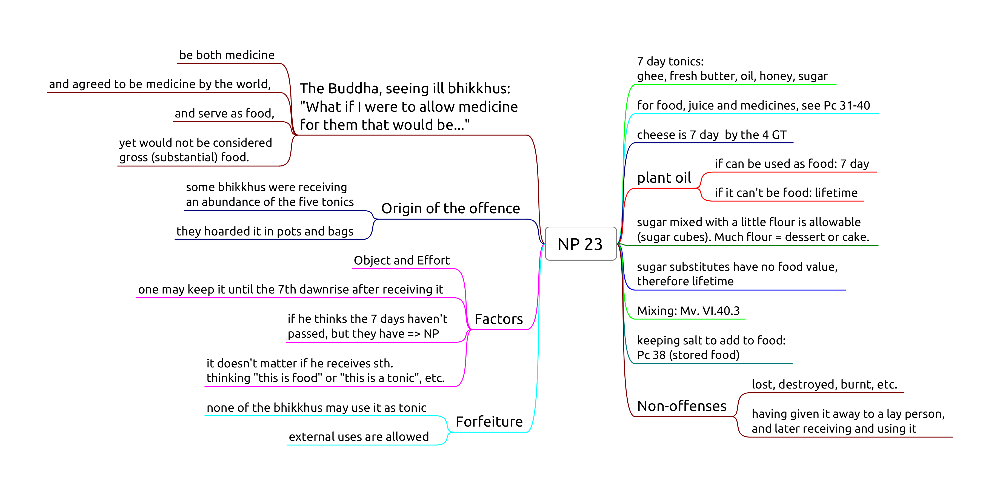
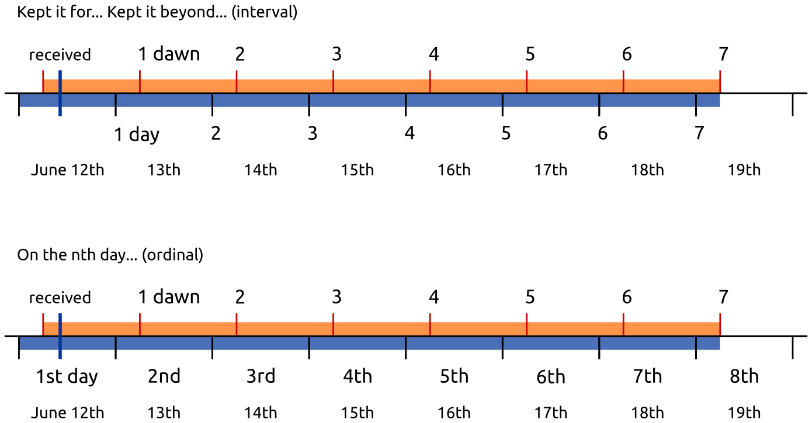

# Food 2

-   **NP 23,** Over-kept tonics
-   **Pc 31,** Public alms centre
-   **Pc 32,** Four bhikkhus specifically invited
-   **Pc 33,** Meal before invitation
-   **Pc 34,** More than three bowlfuls
-   **Pc 35,** More food after turning down what was offered
-   **Pc 36,** Tricking to break Pc 35
-   **Pc 41,** Handing food to members of other religions
-   **Pc 47,** Exceeding an invitation

## NP 23, Over-kept tonics

<!-- latex
\begin{multicols}{2}
-->

**Object:** any of the five tonics.

"There are these five tonics -- ghee, butter, oil, honey, and syrup -- that are
generally regarded as tonics, serve the purpose of nourishment, but are not
considered as substantial food." ([Kd 6](https://suttacentral.net/pli-tv-kd6/en/brahmali))

**Effort:** one keeps the tonic past the 7th dawnrise after receiving it.

**Perception** is not a factor.

If one thinks the 7th dawn haven't passed, but it has, it is still NP.

If one thinks "I receive *this* salt as food for the morning, and *this*
salt as medicine for later", it may be a personal practice, but not part
of the rule. It doesn't affect the period of how long the item may be
used by oneself or any other bhikkhu.

<!-- latex
\end{multicols}
-->

<!-- latex
\clearpage
-->

**Origin:** Ven. Pilindavaccha receives an abundance of tonics, and shares with
his monks. They begin to "fill up basins and waterpots and setting these aside,
they filled their water filters and bags and hung these in the windows. The
tonics were dripping all over and the dwellings became infested with rats." ([NP 23](https://suttacentral.net/pli-tv-bu-vb-np23/en/brahmali))

**Mixing:** The mixture takes on the shortest lifetime of the
ingredients. (Mv. VI.40.3.)

<!-- noexport_latex_begin -->

<table>
  <tbody>
    <tr class="odd">
      <td>a.</td>
      <td>1d juice</td>
      <td>rec. that morning</td>
      <td>+</td>
      <td>food</td>
      <td>rec. that morning</td>
      <td>→</td>
      <td>that morning</td>
    </tr>
    <tr class="even">
      <td>b.</td>
      <td>7d tonic</td>
      <td>rec. that morning</td>
      <td>+</td>
      <td>food</td>
      <td>rec. that morning</td>
      <td>→</td>
      <td>that morning</td>
    </tr>
    <tr class="odd">
      <td>c.</td>
      <td>lifetime medicine</td>
      <td>rec. that morning</td>
      <td>+</td>
      <td>food</td>
      <td>rec. that morning</td>
      <td>→</td>
      <td>that morning</td>
    </tr>
    <tr class="even">
      <td>d.</td>
      <td>7d tonic</td>
      <td>rec. sometime</td>
      <td>+</td>
      <td>juice</td>
      <td>rec. that day</td>
      <td>→</td>
      <td>until dawn</td>
    </tr>
    <tr class="odd">
      <td>e.</td>
      <td>lifetime medicine</td>
      <td>rec. sometime</td>
      <td>+</td>
      <td>juice</td>
      <td>rec. that day</td>
      <td>→</td>
      <td>until dawn</td>
    </tr>
    <tr class="even">
      <td>f.</td>
      <td>lifetime medicine</td>
      <td>rec. sometime</td>
      <td>+</td>
      <td>7d tonic</td>
      <td>rec. sometime</td>
      <td>→</td>
      <td>7 days</td>
    </tr>
  </tbody>
</table>

<!-- noexport_latex_end -->

<!-- latex
\begin{center}
\begin{tabular}{llllllll}
a. & 1d juice & rec. that morning & + & food & rec. that morning & \(\rightarrow\) & that morning\\
\hline
b. & 7d tonic & rec. that morning & + & food & rec. that morning & \(\rightarrow\) & that morning\\
\hline
c. & lifetime medicine & rec. that morning & + & food & rec. that morning & \(\rightarrow\) & that morning\\
\hline
d. & 7d tonic & rec. sometime & + & juice & rec. that day & \(\rightarrow\) & until dawn\\
\hline
e. & lifetime medicine & rec. sometime & + & juice & rec. that day & \(\rightarrow\) & until dawn\\
\hline
f. & lifetime medicine & rec. sometime & + & 7d tonic & rec. sometime & \(\rightarrow\) & 7 days\\
\end{tabular}
\end{center}
-->

### 7 days

*Sattāha paramaṁ*, "up to seven days". The Vinaya counts days from dawn
to dawn, hence one may use a 7 day tonic *until the 7th dawn*.

Confusion arises from "7 days" meaning either "for 7 days" (interval) or
"on the 7th day" (ordinal).

<!-- noexport_latex_begin -->

<!-- noexport_latex_end -->

<!-- latex
\vspace*{\baselineskip}
\includegraphics[width=\linewidth]{../../src/includes/figures/7-days.png}
-->

### Breakfast tray

After dawn, one receives a tray with bread, jams, honey, butter and
salt. At this point the lifetimes are:

-   bread, jams: morning
-   honey, butter: 7 days
-   salt: lifetime

If the knife which one used carries bread morsels or jam into the honey
or the butter, these will be only allowable in the morning.

If one is careful to clean the knife and avoid mixing, one may use them
on the bread and keep the rest until their allowed lifetimes.

The next day, one receives a tray with only bread. One may **not** mix
the allowables from the previous day with the food received today.

Putting the salt, honey or butter (rec. yesterday) on the bread would be
Pc 38 (eating stored food).

## Pc 31, Public alms centre

One may eat one meal at a public alms centre, not two or more days in a row.

Origin: the group of six feel tired of almsround and keep going to the same
public kitchen.

Soup kitchens, homeless shelters, etc. Any place where all comers are offered
food free of charge.

### Non-offenses

- one is invited by the owners
- being ill (not being able to leave)
- the food is intended for bhikkhus
- the centre limits the amount of food one may take (thus being able to censure
  a greedy person)
- eating at an alms centre belonging to one owner one day, at another centre
  belonging to another owner the next day

## Pc 32, Four bhikkhus specifically invited

Origin: Devadatta was telling householders which bhikkhu to give alms to, in
order to form his own faction within the Sangha.

A 'group meal' here means four or more bhikkhus, specifically named in the
invitation, out of the entire community.

There is no offense if the invitation is for 'x number of bhikkhus', leaving the
selection to the community.

## Pc 33, Meal before invitation

Origin: some bhikkhus are concerned about the food at a meal invitation, and go
alms-round nonetheless. There is plenty of food at the invitation, but they
can't eat any more.

See [Snp 4.16](https://www.accesstoinsight.org/tipitaka/kn/snp/snp.4.16.than.html), on how to train oneself:
"He should conquer these four thoughts of lament: 'What will I eat, or where
will I eat. How badly I slept. Tonight where will I sleep?'"

No offense is the donors are informed, e.g. that the bhikkhus will eat breakfast before the midday meal.
It is nonetheless bad manners to eat so much at breakfast to not be able to eat at the meal.

If the donors are not informed, very light food is still allowed, such as drinking thin rice porridge.

## Pc 34, More than three bowlfuls

Origin: some bhikkhus don't know moderation in accepting cakes as provisions from faithful supporters.

<!-- latex
\enlargethispage{\baselineskip}
-->

After accepting the provisions, the bhikkhu should inform the other to not accept more at that place.
It is a *dukkaṭa* offense to not do so.

The term 'provisions' here refers to food prepared for *someone else* going on a journey.
Hence there is no offense if the food was prepared *for the bhikkhu*, although restraint should be exercised.

## Pc 35, More food after turning down what was offered

Origin: some bhikkhus selectively accept some alms-food from one donor, then go
to another donor to have something else they like. The first donor could have offered
all the food they needed, and feels hurt that they went somewhere else for more.

If the bhikkhu already accepted all that the donor wanted to give,
it is not an offense to seek more alms if he would need more food.

The donor may offer more food, and the bhikkhu may accept or refuse certain
items, until he has finished eating (removes his hands from the bowl and pushes
it away, getting up from his seat).

If he refused an item from one donor, he may not accept another item from
another donor.

If he has finished eating, and he had refused more food earlier,
he can't accept more food items which are not leftovers.

If he has finished eating, but he **had not** refused more food earlier,
he may accept more food items.

If another donor arrives with more food, and the bhikkhu had refused some food
earlier, he should ask permission from the earlier donor before receiving more
food, to avoid offending them.

### Non-offenses

- accepting for the sake of another
- accepting the leftovers of another

## Pc 36, Tricking to break Pc 35

Origin: one bhikkhu, having been criticized for his bad behaviour, contrives a
situation for the other bhikkhu to break Pc 35.

**Intention** has to be wishing to find fault and blame the other bhikkhu.

No offense for giving him leftover food to eat.

## Pc 41, Handing food to members of other religions

One places oneself in the position of the followers of other religions.

It is not an offense to prepare food in a tray and placing it so that
they can help themselves.

<!-- latex
\clearpage
-->

## Pc 47, Exceeding an invitation

When an invitation is made that one may ask for certain requisites, one
may use it until four months, unless it has been repeated, or is a
permanent invitation.

### Non-offenses

<!-- latex
\begin{multicols}{2}
-->

-   from relatives
-   for the sake of another
-   from one's own resources
-   being ill, if one shows consideration

<!-- latex
\end{multicols}
-->

"The time period for which we were invited has passed, but we have need
of medicine."

