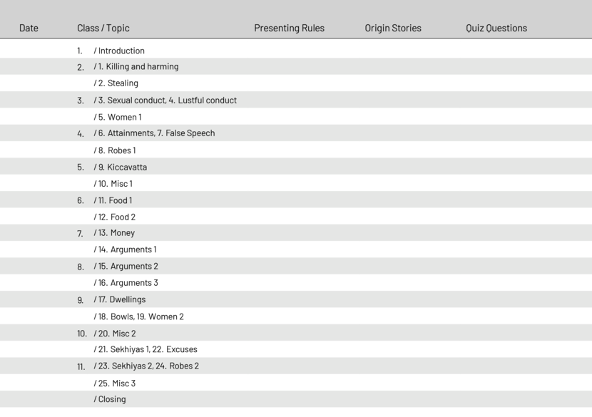
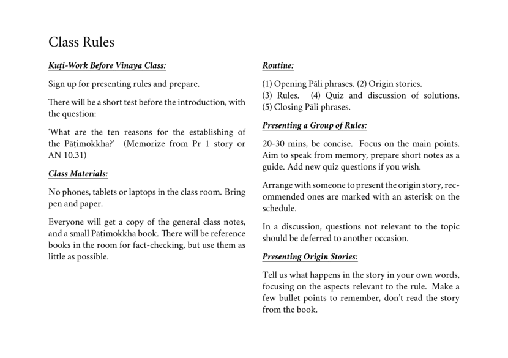
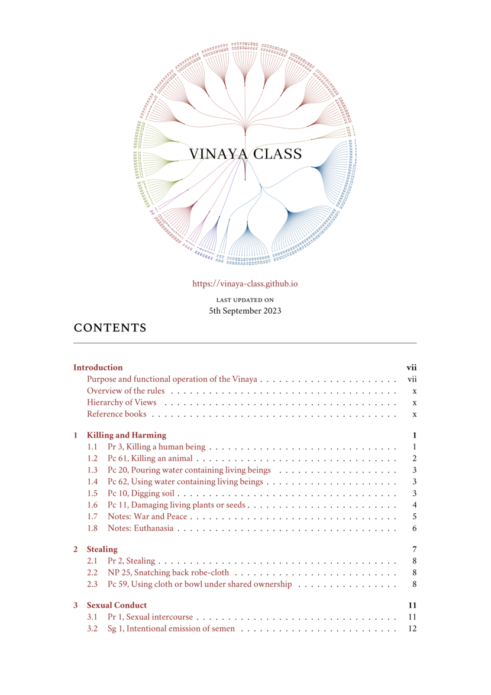

<https://vinaya-class.github.io>

Read here or download as PDF below for printing.

- [vinaya-class.zip](./includes/docs/vinaya-class.zip) All-in-one ZIP archive

Individual files:

- [schedule.pdf](./includes/docs/schedule.pdf)
- [sign-up-sheet.pdf](./includes/docs/sign-up-sheet.pdf)
- [class-rules.pdf](./includes/docs/class-rules.pdf)
- [vinaya-class-notes.pdf](./includes/docs/vinaya-class-notes.pdf)
- [vinaya-class-questions-A.pdf](./includes/docs/vinaya-class-questions-A.pdf)
- [vinaya-class-questions-A-answerkey.pdf](./includes/docs/vinaya-class-questions-A-answerkey.pdf)
- [vinaya-class-questions-B.pdf](./includes/docs/vinaya-class-questions-B.pdf)
- [vinaya-class-questions-B-answerkey.pdf](./includes/docs/vinaya-class-questions-B-answerkey.pdf)
- [pali-lessons.pdf](./includes/docs/pali-lessons.pdf)
- [pali-lessons-answerkey.pdf](./includes/docs/pali-lessons-answerkey.pdf)
- [pali-cheatsheet.pdf](./includes/docs/pali-cheatsheet.pdf)
- [pali-readings.pdf](./includes/docs/pali-readings.pdf)
- [pali-lessons.apkg](./includes/docs/pali-lessons.apkg)
- [pali-readings.apkg](./includes/docs/pali-readings.apkg)
- [chanting-refcard.pdf](./includes/docs/chanting-refcard.pdf)
- [chanting-refcard-4on1.pdf](./includes/docs/chanting-refcard-4on1.pdf)
- [vinayakamma-chart.pdf](./includes/docs/vinayakamma-chart.pdf)

## Schedule

[schedule.pdf](./includes/docs/schedule.pdf)

## Sign-up Sheet

[sign-up-sheet.pdf](./includes/docs/sign-up-sheet.pdf)

## Class Rules

**NOTE:** This is one way to organize the class routine, please adapt as you see
best. One example alternative would be that after presenting the rules, a large
group can be broken up to several smaller ones for the quiz questions and
subsequent discussion, with each sub-group including at least one experienced
/thera/.

[class-rules.pdf](./includes/docs/class-rules.pdf)

## Notes

[vinaya-class-notes.pdf](./includes/docs/vinaya-class-notes.pdf)

## Questions

**NOTE:** The questions are written to _lean toward_ a particular answer, but
they may have different solutions depending on how one imagined the situation
presented. They are intended to be filled out and reviewed together during the
class, discussing the possible solutions.

**Series 'A'**

[vinaya-class-questions-A.pdf](./includes/docs/vinaya-class-questions-A.pdf)

[vinaya-class-questions-A-answerkey.pdf](./includes/docs/vinaya-class-questions-A-answerkey.pdf)

**Series 'B'**

[vinaya-class-questions-B.pdf](./includes/docs/vinaya-class-questions-B.pdf)

[vinaya-class-questions-B-answerkey.pdf](./includes/docs/vinaya-class-questions-B-answerkey.pdf)

## Pāli Lessons

These lessons can be included during a Vinaya study period. The material focues on the language forms used in the Pāṭimokkha, and introduces Pāli readings from the rules and examples from the daily chants which bhikkhus have already memorized.

One lesson may take more than one session to study with a group. Someone familiar with the language may explain the grammar points, while the others may take turns in solving the exercises.

[pali-lessons.pdf](./includes/docs/pali-lessons.pdf)

[pali-lessons-answerkey.pdf](./includes/docs/pali-lessons-answerkey.pdf)

[pali-cheatsheet.pdf](./includes/docs/pali-cheatsheet.pdf)

[pali-readings.pdf](./includes/docs/pali-readings.pdf)

A memory card deck for the [Anki application](https://apps.ankiweb.net/) is included below to help memorizing the vocabulary and sentences using the [Spaced Repetition](https://gwern.net/spaced-repetition) method.

[pali-lessons.apkg](./includes/docs/pali-lessons.apkg)

[pali-readings.apkg](./includes/docs/pali-readings.apkg)

When you import it into Anki for the first time, it will create the relevant card decks.

The above file gets updated as the lesson content develops. When you import it again, Anki creates duplicate cards, which can be removed with these steps:

1. After importing, select Browse > Find Duplicates > 'Front' field can tag the duplicates.
2. Search for: `tag:duplicate is:new`
3. Which can be all deleted.
4. Select the tag 'duplicate' from the sidebar and delete the tag itself, which will remove it from the existing notes.

## Chanting Refcard

[chanting-refcard.pdf](./includes/docs/chanting-refcard.pdf)

[chanting-refcard-4on1.pdf](./includes/docs/chanting-refcard-4on1.pdf)

## Vinayakamma

[vinayakamma-chart.pdf](./includes/docs/vinayakamma-chart.pdf)

